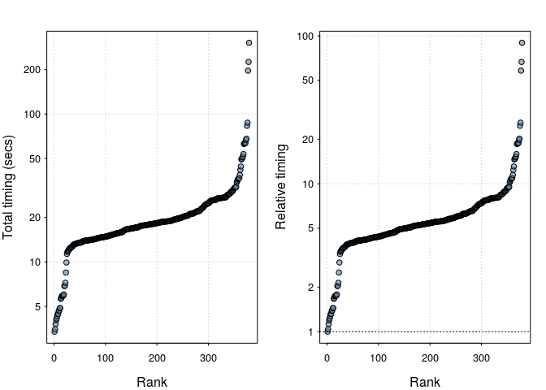

<!-- README.md is generated from README.Rmd. Please edit that file -->
System benchmarking
===================

[](https://travis-ci.org/csgillespie/benchmarkme) [](https://codecov.io/github/csgillespie/benchmarkme?branch=master) [](http://cran.rstudio.com/package=benchmarkme) [](http://cran.r-project.org/package=benchmarkme)

R benchmarking made easy. The package contains a number of benchmarks, heavily based on the benchmarks at <http://r.research.att.com/benchmarks/R-benchmark-25.R>, for assessing the speed of your system.

Installation
------------

The package is now on CRAN and can be installed in the usual way

``` r
install.packages("benchmarkme")
```

To install the development version, use

``` r
devtools::install_github("csgillespie/benchmarkme")
```

Usage
-----

Load the package in the usual way

``` r
library("benchmarkme")
## View past results
plot_past()
```



``` r
## See also shine() # Needs shiny
## get_datatable_past() # Needs DT
```

Obviously the impact on your system will depend on how much RAM and the speed of your CPU. If you have less than 3GB of RAM (run `get_ram()` to find out how much is available on your system), then you should kill any memory hungry applications, e.g. firefox, and only have a single replicate.

To benchmark your system, use

``` r
## This will take somewhere between 0.5 and 5 minutes
## Increase runs if you have a higher spec machine
res = benchmark_std(runs=3)
```

You can compare your results other users

``` r
plot(res)
## See also shine(res)
## get_datatable(res)
```

and upload your results

    ## You can control exactly what is uploaded. See details below.
    upload_results(res)

This function returns a unique identifier that will allow you to identifier your results from the public data sets.

Uploaded data sets
------------------

A summary of the uploaded data sets is available in the [benchmarkmeData](https://github.com/csgillespie/benchmarkme-data) package

``` r
data(past_results, package="benchmarkmeData")
```

A column of this data set, contains the unique identifier returned by the `upload_results` function. A complete version of the uploaded data sets will be made available (soon) in a companion package.

What's uploaded
---------------

Two objects are uploaded:

1.  Your benchmarks (`benchmark_std`);
2.  A summary of your system information (`get_sys_details()`).

The `get_sys_details()` returns:

-   `Sys.info()`;
-   `get_platform_info()`;
-   `get_r_version()`;
-   `get_ram()`;
-   `get_cpu()`;
-   `get_byte_compiler()`;
-   `get_linear_algebra()`;
-   `installed.packages()`;
-   `Sys.getlocale()`;
-   The `benchmarkme` version number;
-   Unique ID - used to extract results;
-   The current date.

The function `Sys.info()` does include the user and nodenames. In the public release of the data, this information will be removed. If you don't wish to upload certain information, just set the corresponding argument, i.e.

``` r
upload_results(res, args=list(sys_info=FALSE))
```
